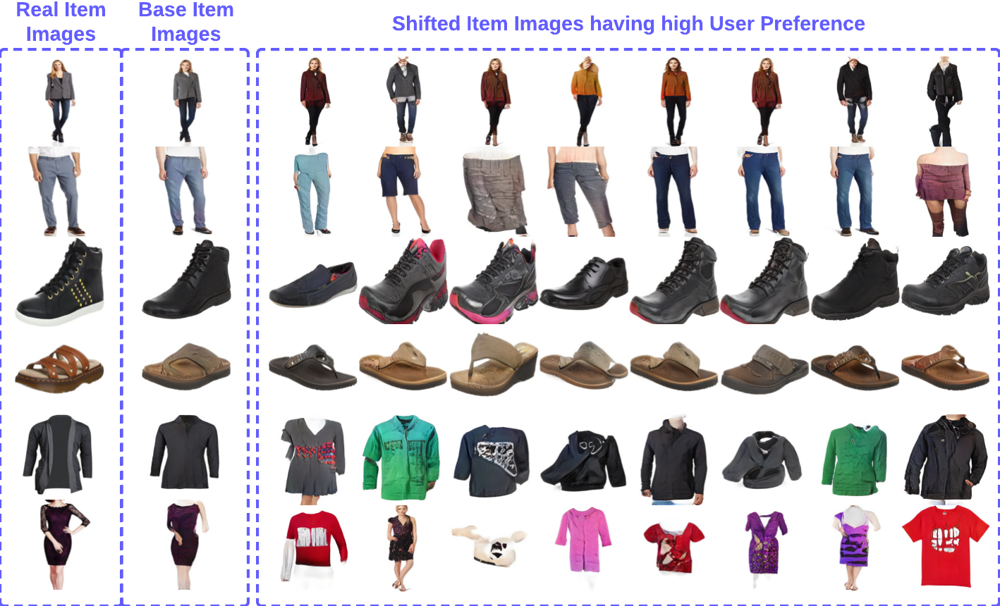

# GAN-Inversion-and-Shifting-GIS

In efforts to better accommodate users, numerous researchers have endeavored to model user behavior, seeking to comprehend how users interact with diverse items within online platforms. This exploration has given rise to recommendation systems, which utilize user-item interactions to tailor a user's item search experience. However, conventional recommendation systems predominantly focus on enhancing user experiences and overlook providing insights for sellers to refine the aesthetics of their items, thereby enhancing user preference—an inverse problem. In this study, we advance beyond user recommendations to propose a novel approach: suggesting item refinements to sellers. Leveraging the visual understanding capabilities of recommendation systems, we provide aesthetical feedback to item sellers in the form of novel images. These images serve as guidance for sellers to adapt existing items to meet the dynamic preferences of users. Our methodology outperforms previous state-of-the-art (SOTA) approaches by generating distinct, realistic images with high user preference, thus bridging the gap between user-centric recommendations and seller-oriented feedback.

Link to Datset: [Amazon Fashion Dataset](https://cseweb.ucsd.edu/~jmcauley/datasets.html#amazon_reviews)
